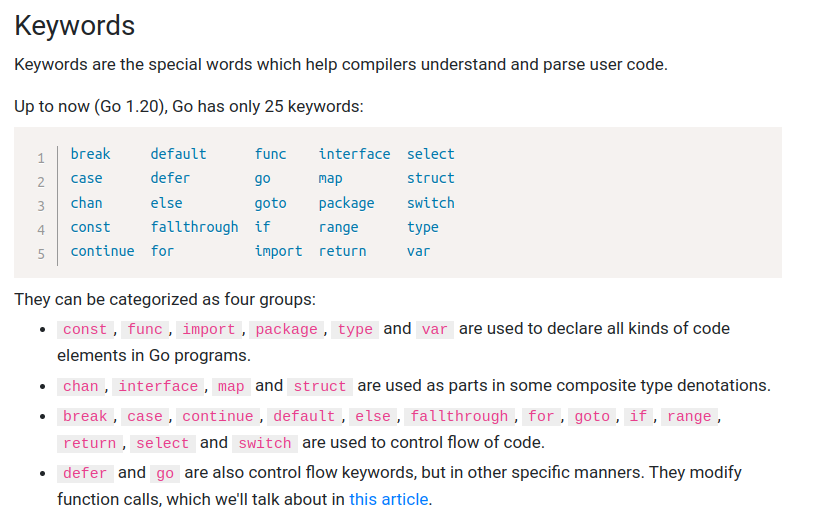

# go-tutorial

## 1. Go Introduction
- What is Go?
  - Go is a cross-platform, open source programming language
  - Go can be used to create high-performance applications
  - Go is a fast, statically typed, compiled language that feels like a dynamically typed, interpreted language
  - Go was developed at Google by Robert Griesemer, Rob Pike, and Ken Thompson in 2007
  - Go's syntax is similar to C++

- What is Go Used For?
  - Web development (server-side)
  - Developing network-based programs
  - Developing cross-platform enterprise applications
  - Cloud-native development

- Why Use Go?
  - Go is fun and easy to learn
  - Go has fast run time and compilation time
  - Go supports concurrency
  - Go has memory management
  - Go works on different platforms (Windows, Mac, Linux, Raspberry Pi, etc.)


## 2. Go Getting Started 
- Go Install 
> [Link Download Go For Window & MacOS](https://go.dev/dl/)

> [Link Download Go For Ubuntu](https://www.fosslinux.com/68795/install-go-on-ubuntu.htm)

- Go Install IDE
> [VS Code](https://code.visualstudio.com/)

> [Intelli IDEA](https://www.jetbrains.com/idea/download/)

- Setup go env for device
> [Link setup go env for device](https://www.geeksforgeeks.org/golang-gopath-and-goroot/)


## 3. Go Syntax
A Go file consists of the fowllowing parts:
- Package declaration
- Import packages
- Functions
- Statements And Expressions


## 4. Go Comments
Command single line : //

Command multi line: /* content ... here */

## 5. Go Variables

##### 5.1 Declare Variables
In go, there are two ways to declare a variable:

Method 1: Using the keyword **var**
  
```go
  var <name_var> <data_type> = <value>
```

example:

```go
package main 
import "fmt"
func main(){
  var numberOne int = 100
  var content string = "Hello"
  var score float32 = 3.8
  var state bool = true 
  fmt.Println(numberOne, content, score, state)
}
```

Method 2: Using the **:=** sign:

```go
  <name_var> := <value>
```

example:

```go
package main
import "fmt"
func main(){
  numberOne := 100
  content := "Hello"
  score := 3.8
  state := true
  fmt.Println(numberOne, content, score, state)
}
```
In live, You can declare var and after init value, example:

```go
package main
import "fmt"
func main(){
  var content string
  content = "Hello, Init value after declare value"
  fmt.Println(content)
}
```

Default value for declare without inital value:
```go
  var x int // default x = 0
  var content string // default value is content = ""
  var state bool // default is state = false
```

Compare Difference between  **var** and **:=**

**Var**
- Can be used inside and outside of functions
- Variables declaration and value assignment can be done separately

**:=**
- Can be used inside functions
- Variables declaration and value assignment can not be done separately(must be done in the separately)


##### 5.2 Declare Multiple Variables
You can using statement to define multiple variables, ex:

```go
package main
import "fmt"
func main(){
  var a,b,c,d int = 1,2,3,4
  fmt.Println(a,b,c,d)
}
```

or if multi variable diff data type you can using this way

```go
package main
import "fmt"
func main(){
  var a,b,c,d = 1 , 2 , "Hello", 4.2
  fmt.Println(a,b,c,d)
}
```
or
```go
package main
import "fmt"
func main(){
   a,b,c,d = 1,2,"Value for c variable",4.5
  fmt.Println(a,b,c,d)
}
```
or
```go
package main
import "fmt"
func main(){
  var (
    a int
    b int = 1
    c string = "value of c"
  )
  fmt.Println(a,b,c,d)
}
```

##### 5.3 Naming Rule
**Go variables naming rules**

A variable can have a short name (like x, y) or more descriptive name (age, price, height, etc.).

Go variable naming rules:
- A variable name must start with a letter or an underscore character (_)
- A variable name cannot start with a digit
- A variable name can only contain alpha-numeric characters and underscores([a-z][A-Z][0-9] and _)
- Variable name are case-sensitive (age, Age, AGE are three different variables)
- There is no limit on the length of the variable name
- A variable name cannot contain spaces
- The variable name connot be any Go Keywords

Go Keywords:


**Multi-Word Variable Names**

Variable names with more than one word can be difficult to read

There are serveral techniques you can use to make them more readable:

**Camel Case**

Each word, except the first, start with a capital letter:
```go
  numberOne := 100
```

**Pascal Case**

Each Word, starts with a capital letter:
```go
  NumberOne := 100
```

**Snake Case**

Each Word is seperated by an underscore character:
```go
  number_one := 100
```
## 6. Go Contants
If a variable should have a fixed value that cannot change, you can use the **const** keyword.

The **const** keyword declares the variable as "constant", which means that it is **unchangeable and read-only**

```go
  const <name_const_var> <data_type> = <value>
```
Declaring the constant, ex
```go
  const PI float32 = 3.14
```

**Naming Rules**
- Constant name follow the same naming rules as variables
- Constant name are usually written int uppercase letters (for easily identification and differentination from variables)
- Constant can be declared both inside and outside  a function


**Constant Types**
There are two type of constants:

- Type constants
- Untyped constants

example type constants:

```go
package main
import ("fmt")

const A int = 1

func main() {
  fmt.Println(A)
}
```

example untyped constant:

```go
package main
import ("fmt")

const A = 1

func main() {
  fmt.Println(A)
}
```
## 7. Go Input & Output 
##### 7.1 Input From Keyboard of OS
Receive data from keyboard from your device you can using the package **os** **bufio** 

example:
```go
package main
import(
    "fmt"
    "os"
    "bufio"
)
func main(){
    var content string
    scanner := bufio.NewScanner(os.Stdin)
    scanner.Scan()
    content = scanner.Text()
    fmt.Println(content)
}
```
other, you can using function Scan from the package **fmt** 
```go
package main
import(
    "fmt"
)
func main(){
    var number_one int
    fmt.Println("Type value for number one: ")
    fmt.Scanln(&number_one)
    fmt.Println("Value of number_one", number_one)
}
```
and output data has:
> Type value for number one:

> 100

> Value of number_one 100

##### 7.2 Output Functions And Formatting Verbs
Print data in console, go has three function:
- **Print()**
- **Println()**
- **Printf()**

**Print() Function**

The Print function prints its arguments with their default format.

example:
```go
package main
import ("fmt")
func main() {
  var i,j string = "Hello","World"

  fmt.Print(i)
  fmt.Print(j)
}
```

output:
> HelloWorld

If you want each word appear in one line, you can using like that:
```go
package main
import ("fmt")
func main() {
  var i,j string = "Hello","World"
  fmt.Print(i, "\n")
  fmt.Print(j, "\n")
}
```

output:
> Hello

> World

**Println() Function**
The **Println()** function is similar to **Print()** with the difference that a whitespace is added between the arguments, and newline is added

at the end

example:
```go
package main
import ("fmt")

func main() {
  var i,j string = "Hello","World"

  fmt.Println(i,j)
}
```
output:
> Hello World

**Printf() Function**
The **Prinf()** function first formats it argument based on the given formatting verb and then prints them.

Here we will use two formatting verbs:
- **%v** is used to print the value of the arguments
```go
package main
import "fmt"
func main(){
    var content string = "Hello"
    fmt.Printf("%v", content)
}
```
>Hello
- **%T** is used to print the type of the arguments
```go
package main
import ("fmt")
func main(){
    var content string = "Hello"
    fmt.Printf("%T", content)
}
```
>string
- **%%** is used to print the % sign
```go 
package main
import ("fmt")
func main(){
    content := "Hello"
    fmt.Printf("%%")
    fmt.Printf("%v %%",content)
}
```
>%Hello %
- **%b** is used to print the base 2 (binary
```go
package main
import ("fmt")
func main(){
    numberOne := 8
    fmt.Printf("%b", numberOne)
}
```
>1000
- **%d** is used to print the base 10 (decimal)
```go
package main
import ("fmt")
func main(){
    numberOne := 8
    fmt.Printf("%d", numberOne)
}
```
> 8
- **%+d** is used to print the base 10 and alway show sign
```go
package main
import ("fmt")
func main(){
    numberOne := 8
    fmt.Printf("%+d", numberOne)
}
```
>+8 
- **%x** is used to print the base 16 and lower case
```go
package main
import ("fmt")
func main(){
    char := "a"
    fmt.Printf("%x", char)
}
```
>61
- **%X** is used to print the base 16 and upper case
- **%#x** is used to print the base 16 and with leading 0x
```go
package main
import ("fmt")
func main(){
    char := "a"
    fmt.Printf("%#x", char)
}
```
>0x61
- **%4d** is used to print padding with space (with 4, right justified)
```go
package main
import ("fmt")
func main(){
    number := 10
    fmt.Printf("%4d", number)
}
```
>|__10
- **%-4d** is used to print padding with space (with 4, left justified)
```go
package main
import ("fmt")
func main(){
    number := 10
    fmt.Printf("%-4d", number)
}
```
> |10__
- **%04d** is used to print padding with 0 (with 4)
```go
package main
import ("fmt")
func main(){
    number := 10
    fmt.Printf("%04d", number)
}
```
> |0010
- **%s** is used to print the value as plain string
```go 
package main
import ("fmt")
func main(){
    content := "this is content"
    fmt.Printf("%s", content)
}
```
> this is content
- **%q** is used to print the value as double-quoted string
```go
package main
import ("fmt")
func main(){
    content := "this is content"
    fmt.Printf("%q", content)
}
```
> "this is content"
- **%8s** is used to print the value as plain string(with 8, right justified)
```go
package main
import ("fmt")
func main(){
    content := "hello"
    fmt.Printf("%8s", content)
}
```
> |___hello
- **%-8s** is used to print the value as plain string (with 8, left justified)
```go
package main
import ("fmt")
func main(){
    content := "hello"
    fmt.Printf("%-8s", content)
}
```
> |hello___
- **% x** is used to print the value as hex dex dump with spaces
```go
package main
import ("fmt")
func main(){
    content := "hello"
    fmt.Printf("% x", content)
}
```
> 68 65 6c 6c 6f
- **%t** is used to print the value of boolean operator in true or false format
```go
package main
import ("fmt")
func main(){
    state := true
    fmt.Printf("%t", state)
}
```
> true 
- **%e** is used to print the value of Scientific notation with 'e' as exponent
```go
package main
import ("fmt")
func main(){
    var value = 3.111
    fmt.Printf("%e", value)
}
```
>3.111000e+00
- **%f** is used to print the value of data type is float, decimal point, no exponent
```go
package main
import ("fmt")
func main(){
    var value = 3.111
    fmt.Printf("%f", value)
}
```
>3.111000
- **%.2f** is used to print the value of data type is float default width and precision 2
```go
package main
import ("fmt")
func main(){
    var value = 3.111
    fmt.Printf("%.2f", value)
}
```
>3.11
- **%6.2f** is used to print the value of data type is float with 6 width and precision 2
```go
package main
import ("fmt")
func main(){
    var value = 3.111
    fmt.Printf("%6.2f", value)
}
```
>|_____3.11
- **%g** is used to print the value with exponent as needed, only necessary digits
```go

package main
import ("fmt")
func main(){
    var value = 3.111
    fmt.Printf("%g", value)
}
```
>3.111
## 8. Go Data Types

## 9. Go Arrays

## 10. Go Slices

## 11. Go Operators

## 12. Go Conditions

## 13. Go Switch

## 14. Go Loops

## 15. Go Functions

## 16. Go Struct

## 17. Go Maps
